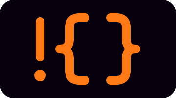

<p align="center"></p>

# ral

A shell grounded on algebraic effects.

Running an external command is performing an effect: `git` is an *operation*,
and the OS is merely its default *interpretation*. Separate the two and you get
typed commands, scoped authority, auditing, and a sandbox from one principle.

And data stays data. Captured output is never re-lexed, word-split, or
glob-expanded, so the whole class of quoting bugs is simply gone.

## A taste

```
let file = 'my report.txt'
let nlines = wc -l < $file       # capture stdout, newline stripped
rm $file                         # exactly one argument, always

curl $primary ? curl $fallback   # ? reacts to failure; | moves data

glob '*.rs' | map { |f| wc -l $f }         # typed pipelines,
let cfg = curl -s $url | from-json         # checked before anything runs

grant [exec: [git: 'allow'], fs: [read: ['/src']], net: false] {
    git log              # permitted
    curl $url            # denied
}
```

Start with the [tutorial](docs/TUTORIAL.md); [examples/](examples) sets
complete scripts against the bash they replace.

## Design

- **Syscalls are effects.** Authority, audit, and failure all fall out of that.
- **Values are not commands.** Call-by-push-value: `{M}` thunks, `!` forces,
  `$` reads.
- **Handlers reinterpret commands** — `within [handlers: …]` for mocks,
  redirection, instrumentation.
- **Capabilities only shrink.** `grant` intersects; it never amplifies.
- **Authority is dynamic, data is lexical.** No mutation, only shadowing.
- **Control flow is a library.** `if`, `for`, `try`, `case` are functions over
  blocks.
- **`if` takes a `Bool`**, never an exit status. There is no `||`.
- **Inferred types**, row-typed records, errors before any process starts.
- **Not POSIX**, on purpose: no word splitting, no `$IFS`, no unquoted globs.

The [rationale](docs/RATIONALE.md) and [spec](docs/SPEC.md) say it at length;
both live at <https://lambdabetaeta.github.io/ral/>.

## Install

```sh
curl -fsSL https://lambdabetaeta.github.io/ral/scripts/install.sh | sh
```

```sh
brew tap lambdabetaeta/ral https://github.com/lambdabetaeta/ral
brew install ral exarch
```

On Windows, run `ral-windows.msi` from the
[latest release](https://github.com/lambdabetaeta/ral/releases/latest).
From source: `cargo install --path ral`.

## Usage

```sh
ral                       # interactive
ral script.ral a b        # $args == [a, b]
ral -c 'echo hello'
ral --check script.ral    # type-check only
ral --audit script.ral    # audit report as JSON on stderr
```

`ral-sh` is a login-shell shim: interactive sessions get ral, everything else
goes to `/bin/sh`, so scp and rsync never notice.

## Around the shell

- **[exarch](exarch/README.md)** — a coding agent whose only tool is ral; its
  sandbox is `grant`.
- **synod** — exarch for office work: grant it a folder and it does the job
  there, inside a real VM, then reports what changed.
- **[plugins/](plugins)** — autosuggestions, fzf pickers, zoxide, written in ral.
- **[editors/](editors)** — tree-sitter grammar and syntax files for most
  editors.
- **[docs/ral-wiki](docs/ral-wiki)** — design chapters and the decision log.

## License

MIT / Apache-2.0. Funded by the Advanced Research + Invention Agency (ARIA).
